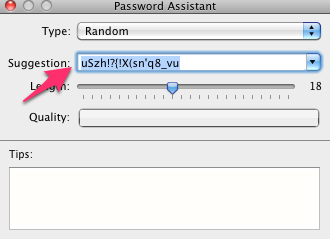

Here are the steps to set up a `tweemux host`-capable OS X box.

# One-time setup

First go to the System Preferences
(⌘ + `Space` → `sys<enter>`, or Apple menu → System Preferences)

You'll need to find the "Sharing" section. On OS X Lion it's under the 3rd
heading, "Internet & Wireless"

On the left you'll see a list of services. In the middle is one that says
"Remote Login", and underneath the hood it is actually good ol' sshd.

You can do this next part one of two ways: keep adding to the "Only these
users" list, or just add them all. It's your call, but in my opinion it's OK to
just do "All users" and then be sure to only add user accounts that are also
people you trust to SSH in. After all, if they can log in locally, what's the
big deal if they can log in remotely?

Now, you should be set to add your first user.

# Per-guest setup

Ask your buddy for their preferred Unix username (that is, what does it say
when they run `echo $USER` at a terminal?)

While you're at it ask what their Github username is, for use in the `tweemux
hubkey` step later on.

Now go back to System Preferences, this time to "System → Users & Groups", or
"System → Accounts" if on Leopard.

First unlock n00b mode. You know what you're doing.

Add a new user by clicking on the little `[+]` near the bottom left.

Then:

Clicking the key brings up the Password Assistant. Use it to set a large random
password: copy the generated password from the Suggestion field and paste it
into the two password fields. We won't need to keep track of this password,
since all authentication will be done with SSH keys.

If you're working with a user that doesn't have public SSH keys (i.e., they
don't have a working Github account), then you can always fall back to password
access. But you have to make fun of them every time they login, so they learn
to not be lame. =P

At this point you're on track for the remainder of
[Host Setup](https://github.com/peopleadmin/tweemux#host-usage).

Quickref for those who already read that doc:

tweemux hubkey unixuser github: githubuser # to get their pubkeys
tweemux forward … # to get a public port
tweemux host # to start the shareable session
tweemux log # to watch them come in. Now you can have them `tweemux on …`
